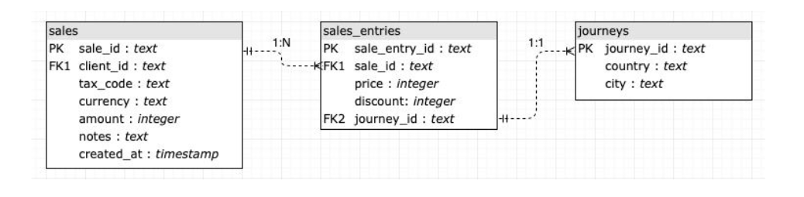

# TeLlevo - A ridesharing Data Challenge

## Exercise 1

### Intro

Please, picture yourself in this situation:

Today is your first day at *TeLlevo*, a top mobility startup, as a data analyst within the Data Team. 
You turn on your laptop and all your favorite analysis tools are ready to go. Then, your phonerings:

The Boss: "*Welcome to the Company! I'm Antonio de Juan, CEO of TeLlevo. I'm sure you will enjoythe challenge of improving cities through technology"*
You: *"Thanks, I'm eager to begin!"*

The Boss: *"Great. I know you've just arrived but I need your help"*
You: *"Sure. What can I do for you?"*

The Boss: *"The new Chief Operating Officer will join us in 48 hours. Please, could you prepare apreliminary data analysis for her? It must have two steps. The first one must be a descriptiveanalysis: what? how many? when? where... you know. "*
You: *"Got it"The Boss: "The second one must include at least three recommendations based on the previousstep. Do you think you can do it?"You: "Of course, Shall I start right now"*

The Boss: *"Thanks and welcome!"*

About TeLlevoTeLlevo is a mobility startup that lets any user to book a ride to from any point A to any point B within the city using a smartphone. Ride value is calculated at the time of request automatically by the app, considering distance, estimated travel time, and current car availability (demand /offer balance). Once the ride ends, we charge passenger's credit card, and transfer 75% of this value to the driver's bank account. Finally, before the passengers gets picked up, the ride can be cancelled by either the driver or the passenger.

### Description

Attached to this email you can find a dataset that contains the first year of TeLlevo journeys.

Please, complete the two steps analysis:

- A descriptive data analysis. Please, answer questions like:
  - how many? (e.g: vehicles, riders, drivers)
  - when? (e.g: journeys/price/cost per time period, are the journeys quick?
  - what? (e.g: reservations/asap, vehicle type)
  - where? (e.g: origin map, best origins)
  - who? (e.g: worst riders, best drivers)○any question you consider interesting
- At least 3 business recommendations based on your previous analysis. Feel free to recommend anything you want, we ask you only one thing: each recommendation must be supported by data

### Tips & Hints:

- Use any tool you want: Tableau (we use it intensively!), Qlik, Python/R notebooks, PowerBI, Excel, Carto...
- We are going to check not only if you know how to make a meaningful analysis but also if you know how to explain it
- If you have any doubt ping us!

***

## Exercise 2

### Intro

Consider these three tables:

- PK means primary key, FK stands for foreign key
- A sale could have multiple sale_entries, each sale_entry only has a journey.

### Description

Please, send us the code for these 3 queries:

- The total sale amount per month, year, and currency. That amount should be divided by 100 and truncated to one decimal.
- The total discount per month, year and currency. Excluding data from 2017.
- The total sale amount per city and country. Excluding those cities whose sales are lower than 1500.